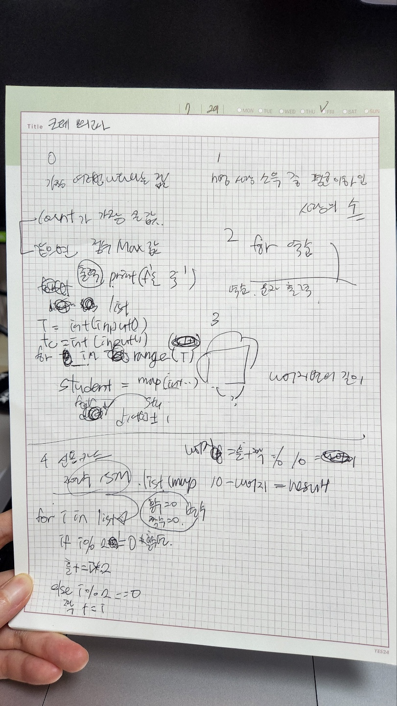

## 후기

- 난이도는 적당했다. 몇개는 좀 헷갈리고 시간도 오래썼다.
- 암호문 문제는 문제 이해하는 것에도 오래걸렸고 남은 시간이 얼마 없어서 풀지 못했다.
- 암호문 문제를 제외하곤 다 풀긴 했지만 불필요한 코드가 꽤 있을 것 같다. 이후에 수정 작업을 하고 싶다.
- 연습장 쓸 때 원래도 좀 악필이긴 하지만 제한시간이 주어지니 마음이 급해져서 더 악필이 됐다. 차분하게 정리하면서 쓰는 습관을 들여야 할 것 같다.

